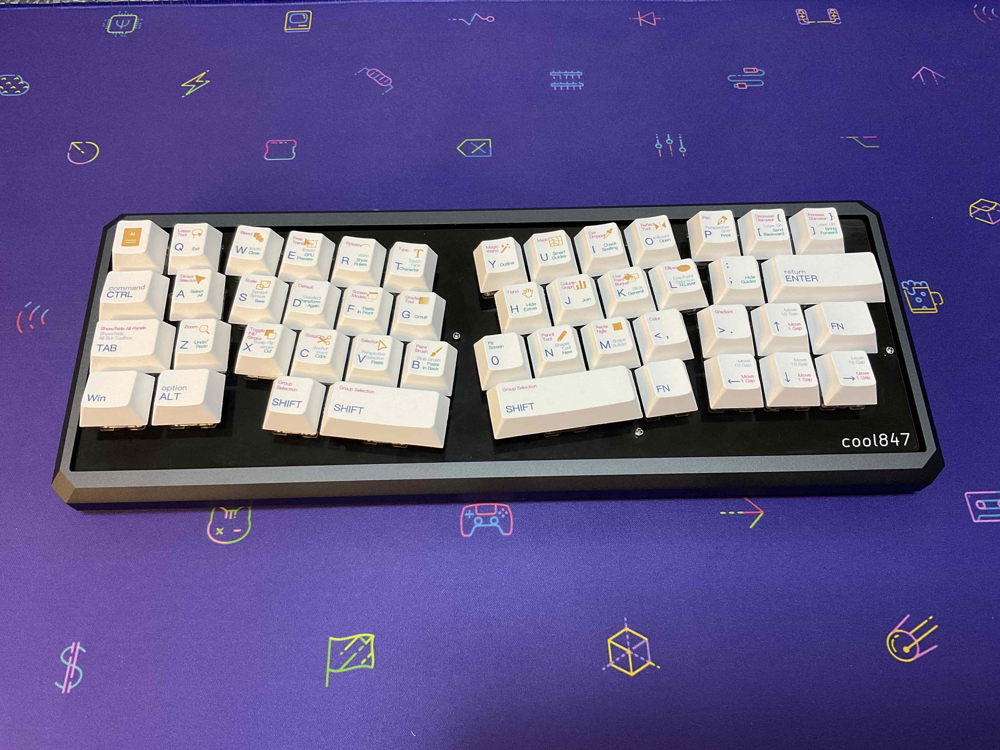
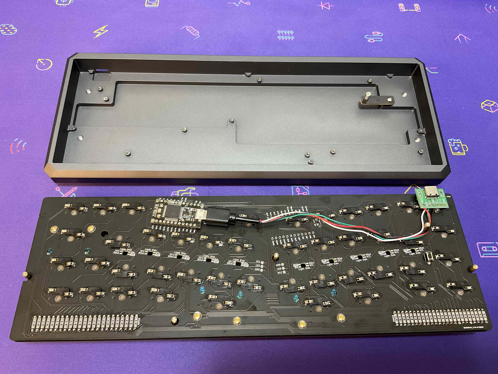
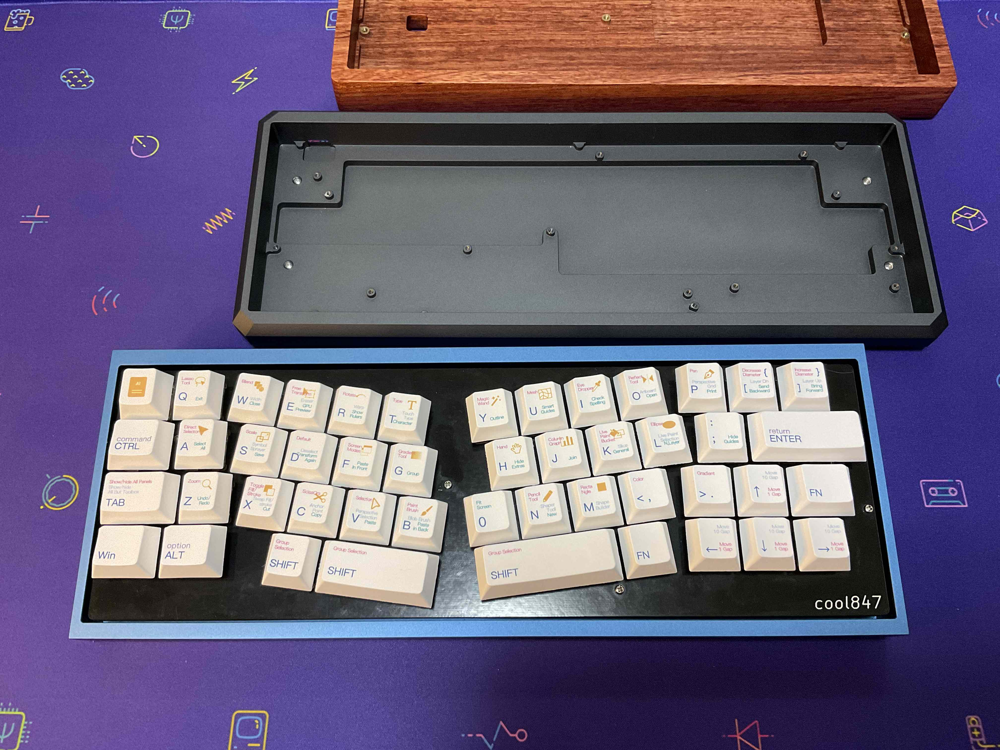

# cool847

## build guide
https://github.com/telzo2000/cool847/blob/main/buildguide_for_cool847.md

 

## 設計に至るまで（Up to the design）
令和3年度初頭に発表した、Poker互換の汎用キーボードケースを使用するcool844は、「コロンブスの卵」的な発想で、好意的な捉えられた。

その後、同じ発想に至る汎用ケースを活用したキーボードが自作キーボード界隈から複数、発表された。 
cool844には構造上の弱点があり、pro microの位置が、ケースの構造との相性問題を引き起こした。
そのため、ver.1.1では、リーフと呼ばれるパーツを用いて、ケース右奥側のネジ固定する工夫を加えた。 
他にも、ケースによっては、pro microとケースが干渉する問題を避けることができなかった。
これについては、pro microの設置位置を複数設ける案としてver.1.2を構想しつつ、全く新設計のver.2.0と言う、
cool844V2と言う形で問題の解決がなされた。 
cool844ver.1.2を別の形で
具体化したのが、cool847である。 
cool847は、他に、cool844と比べて、次の２点を改良した。 
１　アリス配列の肝といえる、キーの傾きを５度から８度にあげた。 
２　キーキャップのベースセットでできる限り対応できるキーレイアウトにする。 
１については、cool836Aを作ったとき、試行錯誤し、傾きを５度とした。
しかし、長くアリス配列を使っていく中で、もう少し角度をつけても大丈夫かと
思うようになり、今回８度まで傾けた。
傾けることにより、キーレアウトのバランスを調整した。 
２については、1の改善をする中で、レジェンドと違う目的を持ったキーキャップを配置することに若干の抵抗があり、
できるだけ、レジェンドの通りにキーキャップを配置できるようにした。
その結果、cool836A、cool844V2のように、中央縦にpro microを設置する空間的な余裕がなくなった。
cool844（ver.1.1)と同じように、キーソケットに被せるように
pro microを設置する方法にした。
 
これらのことを元に、cool844の発展的な改良版として
キーレイアウトを見直した、cool847を設計し、
令和3年9月に完成させた。
 

## 今後の変更予定（Update Plan）
☑︎ビルドガイドの執筆 
☑︎余剰基板の頒布 
☑︎アルミプレートの採用 

